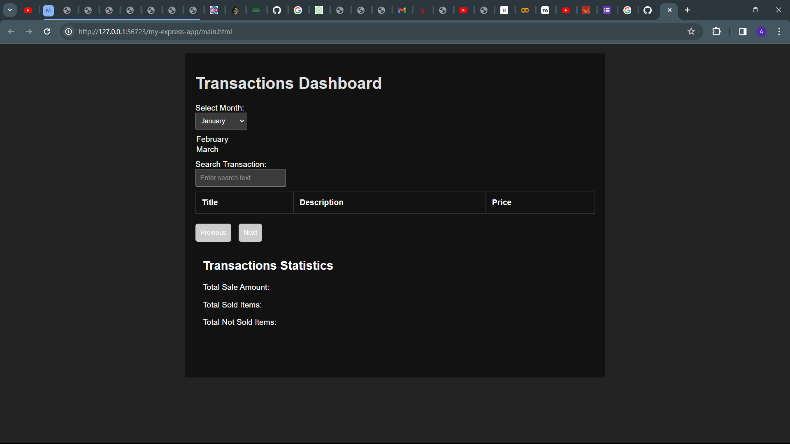
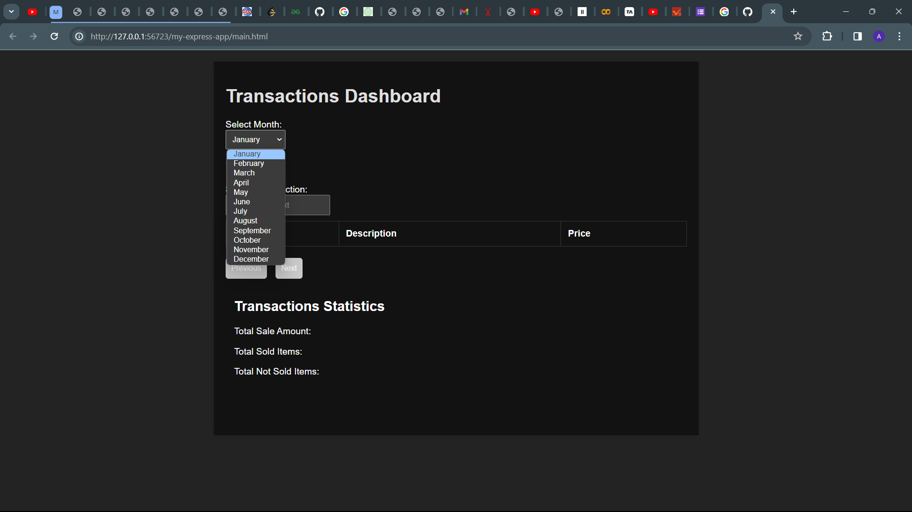

Roxiler-Systems Internship Task

## Description
This project is part of the Internship Task. It includes both the frontend and backend components, utilizing the MERN stack technologies (MongoDB, Express.js, React, Node.js).

## Backend Setup

### Prerequisites
- Node.js and npm installed on your machine.
- MongoDB server installed and running.

### Setting Up the Backend
1. Navigate to the `backend` directory: `cd backend`.
2. Install backend dependencies: `npm install`.
3. Create a `.env` file with your MongoDB connection URI. Example: `MONGODB_URI=mongodb://localhost:27017/mydb`.
4. Start the backend server: `npm start` or `npm run dev` for development with nodemon.

The backend server will be running on `http://localhost:3000`.

## Frontend Setup

### Prerequisites
- Node.js and npm installed on your machine.

### Setting Up the Frontend
1. Navigate to the `frontend` directory: `cd frontend`.
2. Install frontend dependencies: `npm install`.
3. Start the frontend development server: `npm start`.

The frontend development server will be running on `http://localhost:3001`.

## Project Structure
- `backend`: Contains the Express.js backend code.
  - `models`: MongoDB schema models.
  - `routes`: API routes.
  - `server.js`: Backend server entry point.
- `frontend`: Contains the React frontend code.
  - `public`: Static assets.
  - `src`: React components and application logic.
  - `App.js`: Main React component.

## Available Scripts
In the project directory, you can run:

### Backend
- `npm start`: Runs the backend server in production mode.
- `npm run dev`: Runs the backend server in development mode with nodemon.

### Frontend
- `npm start`: Runs the frontend development server.

## API Endpoints
- **GET /api/data**: Get data from MongoDB.
- **POST /api/data**: Add new data to MongoDB.

Output

